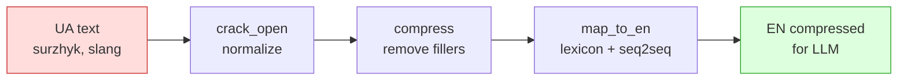

# dormouse

**Ukrainian text optimizer for LLMs** — fewer tokens, better comprehension.

Normalizes surzhyk, slang, fillers, and maps to English for cloud LLMs. Saves 60-73% tokens while *improving* response quality.

> **UA:** Оптимізація українських текстів для LLM. Нормалізує суржик, сленг, мат — і стискає в англійську для Claude/GPT. Економія 60-73% токенів, якість відповідей зростає зі 67% до 100%.

## Results

Tested on 53,351 texts (Telegram corpus + books), 12 IT prompts across 4 GPT models:

| Metric | Value |
|--------|-------|
| Token savings (cloud) | **73%** |
| Token savings (without seq2seq) | **49%** |
| Lexicon coverage | **88%** |
| Seq2seq exact match | **98.2%** |
| GPT response quality (original UA) | 67% |
| GPT response quality (squeezed EN) | **100%** |
| Quality preservation | **150%** (squeezed > original) |

```
Original UA:  "блін продакшн впав після деплою, що робити першим"
Squeezed EN:  "damn production crashed after deploy, what do first"
Tokens:       45 → 12 (-73%)
GPT accuracy: 67% → 100%
```

## How it works



| Layer | What it does | How |
|-------|-------------|-----|
| **crack_open** | surzhyk, slang, profanity → standard UA | 360 rules + pymorphy3 lemmatization |
| **compress** | remove fillers, intensifiers, noise | rule-based pattern matching |
| **map_to_en** | UA → compact English | 47K lexicon + seq2seq (28K expression pairs) |

## Install

```bash
pip install dormouse-ua

# With morphological analysis (recommended)
pip install dormouse-ua[morph]

# Everything
pip install dormouse-ua[all]
```

## Quick start

```python
from dormouse import squeeze

# Normalize only (layers 1+2)
squeeze("шо там по баґу, пофікси плз")
# → "що там по помилці, виправ"

# Cloud mode — compress for Claude/GPT (layers 1+2+3)
squeeze("ваще нормально, канєшно зробимо", target="cloud")
# → "generally ok, sure do"
```

### SDK Middleware (drop-in)

```python
from openai import OpenAI
from dormouse import DormouseClient

client = DormouseClient(OpenAI())  # or Anthropic()

response = client.chat.completions.create(
    model="gpt-4o-mini",
    messages=[{"role": "user", "content": "шо там по деплою, він ваще не робе"}],
)
# Prompt: squeeze → EN → GPT → unsqueeze → Ukrainian response
```

### Semantic search

```python
from dormouse import stir, mumble, sip

stir("report.pdf")                                    # index
results = mumble("холодні закуски")                   # search by meaning
topics = sip("data.xlsx", topics=["HR", "finance"])   # classify
```

### CLI

```bash
dormouse squeeze "шо там по баґу" -t cloud
dormouse stir book.pdf
dormouse mumble "головний герой"
```

## Comparison with alternatives

| Tool | Ukrainian | Token savings | Approach | Quality impact |
|------|:---------:|:------------:|----------|:--------------:|
| **dormouse** | native | **73%** | normalize + compress + translate | **+50% quality** |
| [LLMLingua](https://github.com/microsoft/LLMLingua) | no | up to 20x | ML perplexity pruning (GPT-2/LLaMA) | -5-15% |
| [Selective Context](https://github.com/liyucheng09/Selective_Context) | no | 40-50% | self-information filtering | -10-20% |
| [token-reducer](https://pypi.org/project/token-reducer/) | no | 50-75% | 6-stage pipeline, AST for code | neutral |
| [shrink-prompt](https://pypi.org/project/shrink-prompt/) | no | 30-70% | domain-specific rules (<20ms) | neutral |
| Google Translate → EN | partial | 30-40% | full translation | variable |

**Why dormouse is different:**

The problem: Ukrainian Cyrillic costs [3-4x more tokens](https://www.frontiersin.org/journals/artificial-intelligence/articles/10.3389/frai.2025.1538165/full) than equivalent English text in GPT-4/Claude.

All existing tools (LLMLingua, Selective Context, token-reducer) compress *already English* text by removing information. dormouse solves the problem one level earlier — transforms expensive Ukrainian (3-4 tokens/word) into cheap English (1-1.5 tokens/word) while **preserving all meaning**.

No other tool specifically optimizes Ukrainian for LLMs.

## Use cases

**Cost reduction** — Ukrainian Cyrillic encodes into 2-4x more tokens than equivalent English. dormouse saves 60-73% on input tokens.

**Chatbots & support** — Users write in surzhyk/slang, dormouse normalizes before LLM, GPT gives concrete answers instead of generic responses.

**RAG & document search** — User searches in slang, documents are in literary language. dormouse normalizes both sides → finds by meaning.

**AI agents** — Long chains of actions eat context window. 73% compression = 73% more "memory" for the agent.

**Batch processing** — 10K comments through GPT for sentiment analysis. Squeeze first → cheaper and faster.

**Local search & classification (no API needed)** — `stir/mumble/sip` work fully offline. Index PDF/Excel/TXT, search by meaning, classify by topics — all on CPU with local embeddings (MiniLM-L12-v2). No cloud, no keys, no cost.

## Eval details

Full evaluation ran for 4 days on 53,351 texts:

```
Corpus: 53,351 texts (Telegram + books)
Squeeze speed: 606 texts/sec (normalization)
Seq2seq model: 7.3M params, 28K expression pairs
Stir/mumble: 8,441 chunks indexed, search ~600ms
Sip classification: 99% texts classified (8 topics)
```

### HF Inference API (small models)

| Model | UA score | Squeezed EN score | Delta |
|-------|:--------:|:-----------------:|:-----:|
| Qwen2.5-72B | 4.9/5 | 4.5/5 | -0.4 |
| Qwen2.5-7B | 4.4/5 | 3.6/5 | -0.8 |
| Llama-3.2-1B | 2.7/5 | 2.8/5 | +0.1 |

> Squeeze works great for cloud models (GPT, Claude, 70B+). For small models (<7B), use `brew()` with native Ukrainian — they understand UA better than squeezed EN.

## Architecture

```
src/dormouse/
├── optimizer.py       — squeeze() main pipeline
├── rule_engine.py     — normalization (360 rules + pymorphy3)
├── compressor.py      — filler/noise removal
├── mapper.py          — UA→EN via lexicon + lemma + transliteration
├── seq2seq.py         — expression translator (GRU encoder-decoder)
├── teapot.py          — stir/mumble/sip/brew (search + LLM)
├── embedder.py        — sentence-transformers wrapper
├── middleware.py      — OpenAI/Anthropic SDK proxy
├── cli.py             — Click CLI
└── assets.py          — lazy download of models/data
```

## Development

```bash
git clone https://github.com/ChuprinaDaria/dormouse
cd dormouse
pip install -e ".[dev,morph]"
DORMOUSE_DATA_DIR=./data pytest tests/ -v
```

## License

MIT

---

Built by [Daria Chuprina](https://www.linkedin.com/in/dchuprina/) because she can 👾.

[Lazysoft](https://lazysoft.pl/) | [LinkedIn](https://www.linkedin.com/in/dchuprina/) | [dchuprina@lazysoft.pl](mailto:dchuprina@lazysoft.pl)
