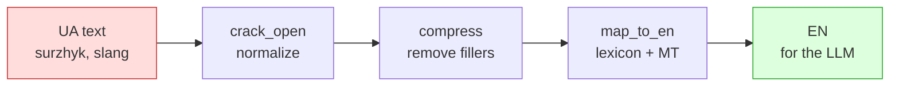

# dormouse

[](https://pypi.org/project/dormouse-ua/)
[](https://pypi.org/project/dormouse-ua/)
[](LICENSE)
[](https://github.com/ChuprinaDaria/dormouse/actions/workflows/ci.yml)
[](https://huggingface.co/Dariachup/dormouse)

**Ukrainian ↔ English bridge for LLM pipelines.** Normalizes surzhyk and slang,
translates chat-register Ukrainian into English on the way in, and back into
Ukrainian on the way out. Runs offline on CPU.

> **UA:** Міст українська ↔ англійська для LLM-пайплайнів. Нормалізує суржик і
> сленг, перекладає розмовну українську в англійську на вході й назад на виході.
> Працює офлайн, на CPU.

---

## What this actually buys you

Two things, measured, in this order of importance:

1. **Small local models become usable in Ukrainian.** A 3B model answering
   Ukrainian directly produces broken orthography and invented words. The same
   model, driven in English through dormouse, produces clean Ukrainian — and
   does it in roughly half the wall-clock time.
2. **Real but modest input-token savings on cloud APIs**: 11-30% depending on
   the provider's tokenizer. Not 60-73%.

### Honest correction to earlier versions of this README

Previous releases claimed 47.5% savings on Claude and a 60-73% headline. Those
numbers came from `scripts/tokenize_benchmark.py`, which uses **local proxy
tokenizers** — `cl100k_base` stood in for Claude, Gemma-2 stood in for Gemini.
Both proxies were wrong in the same direction: they overstate the cost of
Cyrillic on models whose real tokenizers handle it far better.

Everything below is re-measured against the providers' own billing counters via
OpenRouter (`usage.prompt_tokens`). The old script is kept in the repo for
reference; **the numbers it produces are superseded.**

---

## Benchmark 1 — real input tokens (OpenRouter, 2026-08-15)

22 Ukrainian prompts (12 general assistant prompts from the v0.6 agent-pipeline
demo set, 10 real e-commerce customer messages) sent twice to every model: once raw Ukrainian,
once translated to English by `dormouse-mt-uk-en` v0.7. 352 requests total.
Token counts are the providers' own, not a local estimate.

Reproduce: `OPENROUTER_API_KEY=… python scripts/tokenize_openrouter.py`
Raw data: `data/exports/tokenize_openrouter.jsonl` / `.txt`

**As billed** (includes each provider's fixed chat-template overhead):

| target model                            | UK in | EN in | saved |
|-----------------------------------------|------:|------:|------:|
| OpenAI GPT-4                            |   728 |   513 | 29.5% |
| OpenAI GPT-5.5                          |   573 |   483 | 15.7% |
| OpenAI GPT-4.1                          |   595 |   505 | 15.1% |
| Google Gemini 3.7 Flash                 |   431 |   369 | 14.4% |
| Google Gemini 3.1 Pro                   |   431 |   369 | 14.4% |
| Anthropic Claude Opus 5                 |   701 |   625 | 10.8% |
| Anthropic Claude Sonnet 5               |   701 |   625 | 10.8% |
| Anthropic Claude Opus 4.8               |   701 |   625 | 10.8% |

**Content only** (per-model chat-template overhead measured with a one-character
prompt and subtracted from both columns — this is the saving you get on the text
itself, before per-message framing dilutes it):

| target model                            | UK in | EN in | saved |
|-----------------------------------------|------:|------:|------:|
| OpenAI GPT-4                            |   574 |   359 | 37.5% |
| OpenAI GPT-5.5                          |   441 |   351 | 20.4% |
| OpenAI GPT-4.1                          |   441 |   351 | 20.4% |
| Google Gemini 3.7 Flash                 |   431 |   369 | 14.4% |
| Google Gemini 3.1 Pro                   |   431 |   369 | 14.4% |
| Anthropic Claude Opus 5 / Sonnet 5 / Opus 4.8 | 569 | 493 | 13.4% |

### Reading this honestly

- **Legacy GPT-4 / GPT-3.5 (cl100k) is the only place where translation is a
  real cost lever** — ~30-38%. That tokenizer genuinely punishes Cyrillic.
- **Modern frontier tokenizers already handle Ukrainian well.** GPT-5.5,
  Gemini 3.x and Claude land in the 11-20% band. On a short chat message that
  is a handful of tokens. **If your only goal is saving money on Claude or
  GPT-5.5, dormouse is not worth the added latency.**
- These figures are for the **MT path only** (`dormouse-mt-uk-en` translating
  the raw text). The rule-based `squeeze()` layer compresses further by
  removing fillers and intensifiers; that combined pipeline has **not** yet
  been re-measured against real provider counters, so no number is claimed
  for it here.

---

## Benchmark 2 — round-trip through a small local model

The result that actually justifies the project.

Setup: `qwen2.5:3b` on ollama, CPU only, same shop-assistant system prompt in
both arms, 10 real customer messages.

- **CHAIN** — UA → `dormouse-mt-uk-en` → qwen (English system prompt) →
  `dormouse-mt-en-uk` → UA
- **DIRECT** — the same UA message straight to qwen with a Ukrainian system
  prompt and an explicit "answer in Ukrainian" instruction

Reproduce: `python scripts/roundtrip_local_llm.py qwen2.5:3b`
Raw data: `data/exports/roundtrip_qwen3b.txt`

### DIRECT Ukrainian breaks at the orthography level

A 3B model does not have enough Ukrainian to stay inside the language:

```
"Цей перстень складений з сріbullі та латуні."          ← Latin letters mid-word
"...підвищити кваліtat стосунк з клієнтами."            ← same, plus broken case
"Пожалуйста, дайте мені детальніше..."                  ← Russian leaking in
"...я розглядаю винунацію за злиття застібки."          ← invented words
"Ваше замовлення №1042 від {{data.date}}..."            ← template variable emitted
"Дзвінкайте, я перевірю..."                             ← not a word
```

### CHAIN output is fluent

```
UA in    хочу замовити два браслети, знижка якась є на два?
EN in    I want to order two bracelets, is there any kind of discount for two?
EN out   We offer no specific discount but welcome your order!
CHAIN UA Ми не пропонуємо конкретної знижки, а вітаємо ваш заказ!

UA in    а можна оплатити при отриманні? бо карткою не хочу
EN in    Can I pay when I receive it? Because I don't want to pay by card.
EN out   Yes, you can pay upon receipt. We accept all major cards for payment.
CHAIN UA Так, ви можете оплатити чек. Ми приймаємо всі основні картки на оплату.
```

### And it is faster

Two extra 76M translator passes cost less than making a 3B model generate
Cyrillic token by token:

| arm    | per-message wall clock (10 messages, CPU) |
|--------|-------------------------------------------|
| CHAIN  | 22.7 - 49.3 s (median ~40 s)              |
| DIRECT | 49.6 - 95.4 s (median ~70 s)              |

**Takeaway:** the pitch is not "save money on Claude". It is *"run a 3B model
locally and still serve Ukrainian customers"* — no API key, no data leaving
the machine, GDPR-clean, and better output than the same model produces on its
own.

---

## Known failure modes

Read this before shipping dormouse into anything customer-facing. The MT models
are fine-tuned on **159 139 Ukrainian chat pairs** and inherit that domain. Nouns
outside chat register drift, and a wrong noun survives the round trip:

| input | translated as | should be |
|-------|---------------|-----------|
| `реквізити` (bank details) | `refunds` | payment details |
| `гравіювання імені` | `name-playing order` | name engraving |
| `застібка` (clasp) | `zip` → `стільниковий ремонт` | clasp repair |
| `brass` | `мідь` (copper) | латунь |
| `Necklaces` | `краватки` (neckties) | намиста |
| `ring` | `обручка` (wedding ring) | перстень |

Also unfixed: **ти/ви mixing** in the en→uk direction — English has no T-V
distinction, so the reverse model picks a register at random within one reply.

Mitigation today: pass domain terms through a protected-span glossary before
translation (the placeholder-masking machinery already exists in `pii.py`).
A domain-specific e-commerce fine-tune is the proper fix and is not done yet.

---

## MT model quality (held-out eval, sacrebleu)

Fine-tunes of `Helsinki-NLP/opus-mt-uk-en` and `opus-mt-en-uk` on 159 139 real
Ukrainian chat pairs (Telegram, Threads, synthetic surzhyk). 76M params each,
CPU-friendly, MIT-compatible.

**uk→en** — [`Dariachup/dormouse-mt-uk-en`](https://huggingface.co/Dariachup/dormouse-mt-uk-en)

| slice       | base BLEU | ft BLEU   | Δ          | base chrF | ft chrF   | Δ          |
|-------------|----------:|----------:|-----------:|----------:|----------:|-----------:|
| **overall** |     16.93 | **32.50** | **+15.57** |     38.31 | **53.30** | **+14.99** |
| bentega     |     18.00 |     31.44 |     +13.44 |     39.93 |     52.83 |     +12.90 |
| tg_bent     |     14.34 |     23.09 |      +8.75 |     33.75 |     44.48 |     +10.73 |
| threads     |     25.28 |     37.13 |     +11.85 |     46.08 |     56.47 |     +10.39 |
| synth       |     14.70 |     41.70 |     +27.00 |     37.65 |     61.62 |     +23.97 |

**en→uk** — [`Dariachup/dormouse-mt-en-uk`](https://huggingface.co/Dariachup/dormouse-mt-en-uk)

| slice             | base BLEU | ft BLEU   | Δ          | base chrF | ft chrF   | Δ          |
|-------------------|----------:|----------:|-----------:|----------:|----------:|-----------:|
| **overall**       |     10.02 | **20.77** | **+10.75** |     32.98 | **44.07** | **+11.09** |
| inv_bentega       |      9.38 |     17.12 |      +7.74 |     34.20 |     42.95 |      +8.75 |
| inv_tg_bent       |      9.46 |     15.08 |      +5.62 |     28.33 |     34.42 |      +6.09 |
| inv_threads_pairs |     19.26 |     22.88 |      +3.62 |     48.19 |     53.57 |      +5.38 |
| inv_v4_synth      |      6.01 |     30.81 |     +24.80 |     31.48 |     54.68 |     +23.20 |

The reverse direction lags because generating Ukrainian morphology is harder
than generating English, and because the English source side of the training
data is translationese rather than native chat.

**Against cloud translators** — 39 real chat samples, every hypothesis scored
against the same human reference:

| model                       | BLEU      | chrF      | cost / 40 | offline |
|-----------------------------|----------:|----------:|----------:|:-------:|
| Mistral Nemo 12B (cloud)    | **34.48** |     52.68 |   ~$0.003 | ❌      |
| Qwen3-235B (cloud)          |     33.79 | **54.40** |   ~$0.005 | ❌      |
| **`dormouse-mt-uk-en` 76M** |     28.48 |     49.55 |    **$0** | **✅**  |
| Qwen 2.5 7B (cloud)         |     24.74 |     43.55 |   ~$0.006 | ❌      |
| `opus-mt-uk-en` base 76M    |     22.52 |     41.36 |        $0 | ✅      |

A 76M offline model beats generic Qwen 2.5 7B on this domain and sits ~6 BLEU
behind flagship 12B+ cloud translators, with zero API cost and no network.

---

## How it works


```mermaid
graph LR
    A[UA text<br/>surzhyk, slang] --> B[crack_open<br/>normalize]
    B --> C[compress<br/>remove fillers]
    C --> D[map_to_en<br/>lexicon + MT]
    D --> E[EN<br/>for the LLM]

    style A fill:#fdd,stroke:#c33
    style E fill:#dfd,stroke:#3a3
```

| Layer          | What it does                          | How                                    |
|----------------|---------------------------------------|----------------------------------------|
| **crack_open** | surzhyk, slang, profanity → standard UA | 360 rules + pymorphy3 lemmatization  |
| **compress**   | remove fillers, intensifiers, noise   | rule-based pattern matching            |
| **map_to_en**  | UA → English                          | 47K lexicon + seq2seq, or MarianMT v0.7 |

## Install

```bash
pip install dormouse-ua
```

Lexicon (47K entries), seq2seq model (28K expression pairs) and vocab files are
bundled. The MarianMT fine-tunes are downloaded from HuggingFace on first use
and pinned by sha256 in `assets.py`.

```bash
pip install dormouse-ua[ml]      # + torch, sentence-transformers
pip install dormouse-ua[all]     # everything
```

## Quick start

```python
from dormouse import squeeze

# Normalize only (layers 1+2)
squeeze("шо там по баґу, пофікси плз")
# → "що там по помилці, виправ"

# Cloud mode — normalize and map to English (layers 1+2+3)
squeeze("ваще нормально, канєшно зробимо", target="cloud")
# → "generally ok, sure do"
```

### Direct MT access

```python
from dormouse.mt_translator import get_translator

uk_en = get_translator("uk-en")
en_uk = get_translator("en-uk")

en = uk_en.translate("а можна оплатити при отриманні?")
# → "Can I pay when I receive it?"
en_uk.translate("Yes, you can pay upon receipt.")
# → "Так, ви можете оплатити при отриманні."
```

### SDK middleware (drop-in)

```python
from openai import OpenAI
from dormouse import DormouseClient

client = DormouseClient(OpenAI())  # or Anthropic()

response = client.chat.completions.create(
    model="gpt-4o-mini",
    messages=[{"role": "user", "content": "шо там по деплою, він ваще не робе"}],
)
# squeeze → EN → model → unsqueeze → Ukrainian
```

### Classification and search (offline, no API)

```python
from dormouse import sniff, stir, mumble, sip

sniff(["Борщ український", "Чізкейк Нью-Йорк"],
      {"Гарячі страви": "борщ суп юшка", "Десерти": "торт чізкейк еклер"})

stir("report.pdf")                                    # index
mumble("холодні закуски")                             # search by meaning
sip("data.xlsx", topics=["HR", "finance"])            # classify
```

MiniLM-L12-v2 embeddings, CPU, no keys, no cost.

### CLI

```bash
dormouse squeeze "шо там по баґу" -t cloud
dormouse stir book.pdf
dormouse mumble "головний герой"
```

---

## Comparison with alternatives

Every general-purpose prompt-compression tool operates on **already-English**
text. dormouse works one level earlier, on the Ukrainian side.

| tool                                                                      | Ukrainian | approach                          |
|---------------------------------------------------------------------------|:---------:|-----------------------------------|
| **dormouse**                                                              | native    | normalize + compress + translate  |
| [LLMLingua](https://github.com/microsoft/LLMLingua)                       | no        | GPT-2 perplexity pruning          |
| [Selective Context](https://github.com/liyucheng09/Selective_Context)     | no        | self-information filtering        |
| [token-reducer](https://pypi.org/project/token-reducer/)                  | no        | 6-stage pipeline                  |

On a shared 20-prompt Ukrainian set, LLMLingua removed ~10% of tokens — its
GPT-2 perplexity model does not read Cyrillic well enough to prune it. That
comparison was made with local tokenizers and is being re-run against real
provider counters; treat the exact percentages as provisional.

## Use cases

- **Local, private Ukrainian assistants** — the strongest case. Run a 3B model
  on your own hardware and still get fluent Ukrainian. Nothing leaves the box.
- **Chatbots and support** — users write in surzhyk and slang; normalize before
  the model sees it.
- **RAG** — user searches in slang, documents are in literary Ukrainian.
  Normalize both sides and match by meaning.
- **Legacy GPT-4 / GPT-3.5 pipelines** — the one place the token saving is
  large enough to matter on its own.
- **Offline search and classification** — `stir` / `mumble` / `sip` need no API.

## Eval details

```
Corpus:         53,351 texts (Telegram + books)
Squeeze speed:  606 texts/sec (normalization)
Seq2seq model:  7.3M params, 28K expression pairs
MT models:      76M params each, MarianMT, CPU inference
Stir/mumble:    8,441 chunks indexed, search ~600 ms
```

Quality-preservation scores from earlier releases (99-102% across the GPT-4.1
family) were produced by a heuristic length-and-structure judge, not an LLM
judge. They are directionally useful, not precise, and are not reprinted here
as headline claims.

## Architecture

```
src/dormouse/
├── optimizer.py       — squeeze() main pipeline
├── unsqueeze.py       — EN → UA on the way back
├── mt_translator.py   — MarianMT fine-tunes (uk-en, en-uk)
├── rule_engine.py     — normalization (360 rules + pymorphy3)
├── compressor.py      — filler/noise removal
├── classifier.py      — sniff() embeddings-based classification
├── mapper.py          — UA→EN via lexicon + lemma + transliteration
├── seq2seq.py         — expression translator (GRU encoder-decoder)
├── teapot.py          — stir/mumble/sip/brew (search + LLM)
├── embedder.py        — sentence-transformers wrapper
├── middleware.py      — OpenAI/Anthropic SDK proxy
├── cli.py             — Click CLI
├── assets.py          — bundled data + sha256-pinned model download
└── data/              — lexicon.db, seq2seq model, vocab, rules
```

## Development

```bash
git clone https://github.com/ChuprinaDaria/dormouse
cd dormouse
pip install -e ".[dev,morph]"
DORMOUSE_DATA_DIR=./data pytest tests/ -v
```

Benchmarks:

```bash
OPENROUTER_API_KEY=… python scripts/tokenize_openrouter.py   # real token cost
python scripts/roundtrip_local_llm.py qwen2.5:3b             # local round-trip
```

## License

MIT

---

Built by [Daria Chuprina](https://www.linkedin.com/in/dchuprina/) because she can 👾.

[Lazysoft](https://lazysoft.pl/) | [LinkedIn](https://www.linkedin.com/in/dchuprina/) | [dchuprina@lazysoft.pl](mailto:dchuprina@lazysoft.pl)
